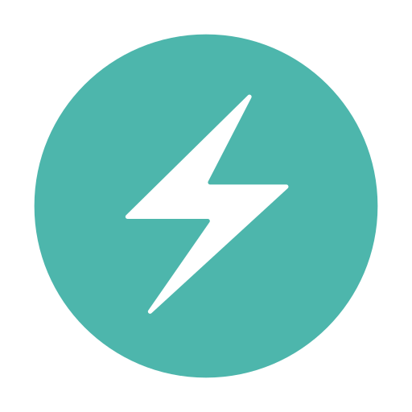
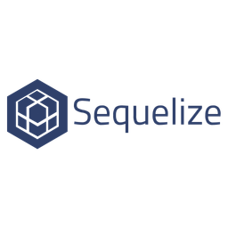
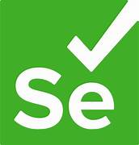

# ¡𝗛𝗼𝗹𝗮 𝘀𝗲𝗮𝗻 𝗯𝗶𝗲𝗻𝘃𝗲𝗻𝗶𝗱𝗼s!👨‍💻👋

# 𝗔𝗰𝗲𝗿𝗰𝗮 𝗱𝗲 𝗺𝗶:  💬

𝘚𝘰𝘺 𝘍𝘢𝘤𝘶𝘯𝘥𝘰 𝘛𝘰𝘣𝘪𝘰, 𝘵𝘦́𝘤𝘯𝘪𝘤𝘰 𝘥𝘦𝘯𝘵𝘢𝘭 𝘨𝘳𝘢𝘥𝘶𝘢𝘥𝘰 𝘥𝘦 𝘭𝘢 𝘜𝘯𝘪𝘷𝘦𝘳𝘴𝘪𝘥𝘢𝘥 𝘕𝘢𝘤𝘪𝘰𝘯𝘢𝘭 𝘥𝘦 𝘓𝘢 𝘗𝘭𝘢𝘵𝘢, 𝘢𝘤𝘵𝘶𝘢𝘭𝘮𝘦𝘯𝘵𝘦 𝘍𝘶𝘭𝘭 𝘚𝘵𝘢𝘤𝘬 𝘋𝘦𝘷𝘦𝘭𝘰𝑝𝘦𝘳 𝘺 𝘘𝘶𝘢𝘭𝘪𝘵𝘺 𝘈𝘴𝘴𝘶𝘳𝘢𝘯𝘤𝘦, 𝘤𝘰𝘯 𝘶𝘯 𝑝𝘦𝘳𝘧𝘪𝘭 𝘰𝘳𝘪𝘦𝘯𝘵𝘢𝘥𝘰 𝘢𝘭 𝘢𝑝𝘳𝘦𝘯𝘥𝘪𝘻𝘢𝘫𝘦 𝘤𝘰𝘯𝘵𝘪𝘯𝘶𝘰, 𝘤𝘰𝘮𝘣𝘪𝘯𝘰 𝘩𝘢𝘣𝘪𝘭𝘪𝘥𝘢𝘥𝘦𝘴 𝘥𝘦 𝘥𝘦𝘴𝘢𝘳𝘳𝘰𝘭𝘭𝘰 𝘺 𝘵𝘦𝘴𝘵𝘪𝘯𝘨 𝑝𝘢𝘳𝘢 𝘦𝘯𝘵𝘳𝘦𝘨𝘢𝘳 𝘴𝘰𝘭𝘶𝘤𝘪𝘰𝘯𝘦𝘴 𝘥𝘦 𝘢𝘭𝘵𝘢 𝘤𝘢𝘭𝘪𝘥𝘢𝘥.
 
𝘌𝘯 𝘮𝘪 𝘵𝘳𝘢𝘺𝘦𝘤𝘵𝘰𝘳𝘪𝘢 𝑝𝘳𝘰𝘧𝘦𝘴𝘪𝘰𝘯𝘢𝘭, 𝘩𝘦 𝘵𝘳𝘢𝘣𝘢𝘫𝘢𝘥𝘰 𝘦𝘯 𝘭𝘢 𝘤𝘳𝘦𝘢𝘤𝘪𝘰́𝘯, 𝘮𝘦𝘫𝘰𝘳𝘢 𝘺 𝘮𝘢𝘯𝘵𝘦𝘯𝘪𝘮𝘪𝘦𝘯𝘵𝘰 𝘥𝘦 𝘴𝘪𝘴𝘵𝘦𝘮𝘢𝘴 𝘦𝘯 𝘢́𝘳𝘦𝘢𝘴 𝘤𝘰𝘮𝘰 𝘭𝘦𝘢𝘴𝘪𝘯𝘨, 𝘧𝘢𝘤𝘵𝘰𝘳𝘪𝘯𝘨 𝘺 𝘨𝘦𝘴𝘵𝘪𝘰́𝘯 𝘥𝘦 𝘤𝘰𝘯𝘵𝘳𝘢𝘵𝘰𝘴.
 
𝘊𝘶𝘦𝘯𝘵𝘰 𝘤𝘰𝘯 𝘦𝘹𝑝𝘦𝘳𝘪𝘦𝘯𝘤𝘪𝘢 𝘪𝘮𝑝𝘭𝘦𝘮𝘦𝘯𝘵𝘢𝘯𝘥𝘰 𝘮𝘪𝘤𝘳𝘰𝘴𝘦𝘳𝘷𝘪𝘤𝘪𝘰𝘴 𝘦𝘧𝘪𝘤𝘪𝘦𝘯𝘵𝘦𝘴, 𝘰𝑝𝘵𝘪𝘮𝘪𝘻𝘢𝘯𝘥𝘰 𝘣𝘢𝘴𝘦𝘴 𝘥𝘦 𝘥𝘢𝘵𝘰𝘴 𝘺 𝘥𝘦𝘴𝘢𝘳𝘳𝘰𝘭𝘭𝘢𝘯𝘥𝘰 𝘧𝘭𝘶𝘫𝘰𝘴 𝘢𝘶𝘵𝘰𝘮𝘢𝘵𝘪𝘻𝘢𝘥𝘰𝘴 𝘲𝘶𝘦 𝘪𝘯𝘤𝘳𝘦𝘮𝘦𝘯𝘵𝘢𝘯 𝘭𝘢 𝑝𝘳𝘰𝘥𝘶𝘤𝘵𝘪𝘷𝘪𝘥𝘢𝘥 𝘺 𝘦𝘭 𝘰𝘳𝘥𝘦𝘯 𝘦𝘯 𝘭𝘰𝘴 𝑝𝘳𝘰𝘤𝘦𝘴𝘰𝘴, 𝘺 𝘶𝘵𝘪𝘭𝘪𝘻𝘢𝘯𝘥𝘰 𝘵𝘦́𝘤𝘯𝘪𝘤𝘢𝘴 𝘥𝘦 𝘸𝘦𝘣 𝘴𝘤𝘳𝘢𝑝𝘪𝘯𝘨 𝑝𝘢𝘳𝘢 𝘭𝘢 𝘦𝘹𝘵𝘳𝘢𝘤𝘤𝘪𝘰́𝘯 𝘺 𝘢𝘯𝘢́𝘭𝘪𝘴𝘪𝘴 𝘥𝘦 𝘥𝘢𝘵𝘰𝘴, 𝘮𝘦𝘫𝘰𝘳𝘢𝘯𝘥𝘰 𝘭𝘢 𝑝𝘳𝘦𝘤𝘪𝘴𝘪𝘰́𝘯 𝘺 𝘭𝘢 𝘦𝘧𝘪𝘤𝘪𝘦𝘯𝘤𝘪𝘢 𝘦𝘯 𝘭𝘢 𝘰𝘣𝘵𝘦𝘯𝘤𝘪𝘰́𝘯 𝘥𝘦 𝘪𝘯𝘧𝘰𝘳𝘮𝘢𝘤𝘪𝘰́𝘯 𝘤𝘭𝘢𝘷𝘦.
 

# 𝗠𝗶𝘀 𝗼𝗯𝗷𝗲𝘁𝗶𝘃𝗼𝘀:  🔮
𝘌𝘴𝘵𝘰𝘺 𝘤𝘰𝘮𝑝𝘳𝘰𝘮𝘦𝘵𝘪𝘥𝘰 𝘤𝘰𝘯 𝘮𝘪 𝘤𝘳𝘦𝘤𝘪𝘮𝘪𝘦𝘯𝘵𝘰 𝑝𝘳𝘰𝘧𝘦𝘴𝘪𝘰𝘯𝘢𝘭 𝘺 𝑝𝘦𝘳𝘴𝘰𝘯𝘢𝘭, 𝘮𝘪 𝘰𝘣𝘫𝘦𝘵𝘪𝘷𝘰 𝑝𝘳𝘪𝘯𝘤𝘪𝑝𝘢𝘭 𝘦𝘴 𝘴𝘦𝘨𝘶𝘪𝘳 𝘦𝘷𝘰𝘭𝘶𝘤𝘪𝘰𝘯𝘢𝘯𝘥𝘰 𝘤𝘰𝘮𝘰 𝘥𝘦𝘴𝘢𝘳𝘳𝘰𝘭𝘭𝘢𝘥𝘰𝘳 𝘸𝘦𝘣 𝘺 𝘵𝘦𝘴𝘵𝘦𝘳, 𝘢𝘥𝘲𝘶𝘪𝘳𝘪𝘦𝘯𝘥𝘰 𝘯𝘶𝘦𝘷𝘢𝘴 𝘩𝘢𝘣𝘪𝘭𝘪𝘥𝘢𝘥𝘦𝘴 𝘵𝘦́𝘤𝘯𝘪𝘤𝘢𝘴 𝘺 𝘮𝘦𝘫𝘰𝘳𝘢𝘯𝘥𝘰 𝘤𝘰𝘯𝘴𝘵𝘢𝘯𝘵𝘦𝘮𝘦𝘯𝘵𝘦 𝘮𝘪 𝘤𝘢𝑝𝘢𝘤𝘪𝘥𝘢𝘥 𝑝𝘢𝘳𝘢 𝘳𝘦𝘴𝘰𝘭𝘷𝘦𝘳 𝑝𝘳𝘰𝘣𝘭𝘦𝘮𝘢𝘴.
  
𝘔𝘪 𝘮𝘦𝘵𝘢 𝘦𝘴 𝘢𝘭𝘤𝘢𝘯𝘻𝘢𝘳 𝘯𝘶𝘦𝘷𝘰𝘴 𝘯𝘪𝘷𝘦𝘭𝘦𝘴 𝘥𝘦 𝘦𝘹𝘤𝘦𝘭𝘦𝘯𝘤𝘪𝘢 𝘦𝘯 𝘮𝘪 𝘤𝘢𝘳𝘳𝘦𝘳𝘢, 𝘮𝘪𝘦𝘯𝘵𝘳𝘢𝘴 𝘤𝘶𝘭𝘵𝘪𝘷𝘰 𝘩𝘢𝘣𝘪𝘭𝘪𝘥𝘢𝘥𝘦𝘴 𝘪𝘯𝘵𝘦𝘳𝑝𝘦𝘳𝘴𝘰𝘯𝘢𝘭𝘦𝘴 𝘺 𝘧𝘰𝘳𝘵𝘢𝘭𝘦𝘻𝘤𝘰 𝘮𝘪 𝘤𝘰𝘮𝑝𝘦𝘵𝘦𝘯𝘤𝘪𝘢 𝘦𝘯 𝘪𝘯𝘨𝘭𝘦́𝘴.
  
𝘌𝘴𝘵𝘰𝘺 𝘦𝘮𝘰𝘤𝘪𝘰𝘯𝘢𝘥𝘰 𝑝𝘰𝘳 𝘦𝘭 𝘧𝘶𝘵𝘶𝘳𝘰 𝘺 𝘭𝘪𝘴𝘵𝘰 𝑝𝘢𝘳𝘢 𝘦𝘯𝘧𝘳𝘦𝘯𝘵𝘢𝘳 𝘭𝘰𝘴 𝘥𝘦𝘴𝘢𝘧í𝘰𝘴 𝘲𝘶𝘦 𝘮𝘦 𝘢𝘺𝘶𝘥𝘢𝘳𝘢́𝘯 𝘢 𝘤𝘰𝘯𝘷𝘦𝘳𝘵𝘪𝘳𝘮𝘦 𝘦𝘯 𝘶𝘯𝘢 𝘮𝘦𝘫𝘰𝘳 𝘷𝘦𝘳𝘴𝘪𝘰́𝘯 𝘥𝘦 𝘮í 𝘮𝘪𝘴𝘮𝘰.

# 𝗧𝗲𝗰𝗻𝗼𝗹𝗼𝗴í𝗮𝘀 𝘆 𝗵𝗲𝗿𝗿𝗮𝗺𝗶𝗲𝗻𝘁𝗮𝘀: 💻🖱

<h2 align="center">𝙇𝙚𝙣𝙜𝙪𝙖𝙟𝙚𝙨</h2>

<h2 align="center"> 𝙁𝙧𝙤𝙣𝙩-𝙚𝙣𝙙 𝙏𝙤𝙤𝙡𝙨</h2>

<h2 align="center"> 𝘽𝙖𝙘𝙠-𝙚𝙣𝙙 𝙏𝙤𝙤𝙡𝙨</h2>

<h2 align="center"> 𝘽𝙖𝙨𝙚𝙨 𝙙𝙚 𝙙𝙖𝙩𝙤𝙨 𝙮 𝙂𝙚𝙨𝙩𝙤𝙧𝙚𝙨</h2>

<h2 align="center">𝙏𝙚𝙨𝙩𝙞𝙣𝙜 𝙏𝙤𝙤𝙡𝙨</h2>

<h2 align="center">𝙂𝙚𝙨𝙩𝙞𝙤𝙣 𝙮 𝙊𝙧𝙜𝙖𝙣𝙞𝙯𝙖𝙘𝙞𝙤́𝙣</h2>

 
 

# 𝗔𝗰𝘁𝗶𝘃𝗶𝗱𝗮𝗱 𝘆 𝗣𝗿𝗼𝘆𝗲𝗰𝘁𝗼𝘀

𝘌𝘴 𝑝𝘰𝘴𝘪𝘣𝘭𝘦 𝘲𝘶𝘦 𝘯𝘰𝘵𝘦𝘯 𝘲𝘶𝘦 𝘮𝘪 𝘩𝘪𝘴𝘵𝘰𝘳𝘪𝘢𝘭 𝘥𝘦 𝘤𝘰𝘮𝘮𝘪𝘵𝘴 𝘺 𝘭𝘢 𝘢𝘤𝘵𝘪𝘷𝘪𝘥𝘢𝘥 𝘦𝘯 𝘮𝘪 𝘮𝘢𝑝𝘢 𝘥𝘦 𝑝𝘶𝘴𝘩'𝘴 𝘯𝘰 𝘳𝘦𝘧𝘭𝘦𝘫𝘢𝘯 𝘶𝘯𝘢 𝘨𝘳𝘢𝘯 𝘤𝘢𝘯𝘵𝘪𝘥𝘢𝘥 𝘥𝘦 𝑝𝘳𝘰𝘺𝘦𝘤𝘵𝘰𝘴 𝑝𝘦𝘳𝘴𝘰𝘯𝘢𝘭𝘦𝘴. 𝘌𝘴𝘵𝘰 𝘴𝘦 𝘥𝘦𝘣𝘦 𝘢 𝘲𝘶𝘦 𝘤𝘰𝘮𝘦𝘯𝘤𝘦́ 𝘢 𝘵𝘳𝘢𝘣𝘢𝘫𝘢𝘳 𝘦𝘯 𝘦𝘭 𝘢́𝘮𝘣𝘪𝘵𝘰 𝑝𝘳𝘰𝘧𝘦𝘴𝘪𝘰𝘯𝘢𝘭 𝘳𝘢𝑝𝘪𝘥𝘢𝘮𝘦𝘯𝘵𝘦 𝘭𝘶𝘦𝘨𝘰 𝘥𝘦 𝘵𝘦𝘳𝘮𝘪𝘯𝘢𝘳 𝘮𝘪𝘴 𝘦𝘴𝘵𝘶𝘥𝘪𝘰𝘴, 𝘭𝘰 𝘲𝘶𝘦 𝘭𝘪𝘮𝘪𝘵𝘰́ 𝘦𝘭 𝘵𝘪𝘦𝘮𝑝𝘰 𝘥𝘪𝘴𝑝𝘰𝘯𝘪𝘣𝘭𝘦 𝑝𝘢𝘳𝘢 𝘥𝘦𝘴𝘢𝘳𝘳𝘰𝘭𝘭𝘢𝘳 𝑝𝘳𝘰𝘺𝘦𝘤𝘵𝘰𝘴 𝘪𝘯𝘥𝘦𝑝𝘦𝘯𝘥𝘪𝘦𝘯𝘵𝘦𝘴.
 
𝘚𝘪𝘯 𝘦𝘮𝘣𝘢𝘳𝘨𝘰, 𝘩𝘦 𝘵𝘦𝘯𝘪𝘥𝘰 𝘭𝘢 𝘰𝑝𝘰𝘳𝘵𝘶𝘯𝘪𝘥𝘢𝘥 𝘥𝘦 𝘵𝘳𝘢𝘣𝘢𝘫𝘢𝘳 𝘦𝘯 𝘯𝘶𝘮𝘦𝘳𝘰𝘴𝘰𝘴 𝑝𝘳𝘰𝘺𝘦𝘤𝘵𝘰𝘴 𝘴𝘪𝘨𝘯𝘪𝘧𝘪𝘤𝘢𝘵𝘪𝘷𝘰𝘴 𝘦𝘯 𝘭𝘢 𝘦𝘮𝑝𝘳𝘦𝘴𝘢 𝘥𝘰𝘯𝘥𝘦 𝘦𝘴𝘵𝘰𝘺 𝘦𝘮𝑝𝘭𝘦𝘢𝘥𝘰. 𝘌𝘴𝘵𝘰𝘴 𝑝𝘳𝘰𝘺𝘦𝘤𝘵𝘰𝘴 𝘩𝘢𝘯 𝘤𝘰𝘯𝘵𝘳𝘪𝘣𝘶𝘪𝘥𝘰 𝘢 𝘮𝘪 𝘤𝘳𝘦𝘤𝘪𝘮𝘪𝘦𝘯𝘵𝘰 𝑝𝘳𝘰𝘧𝘦𝘴𝘪𝘰𝘯𝘢𝘭 𝘺 𝘩𝘢𝘯 𝘢𝘮𝑝𝘭𝘪𝘢𝘥𝘰 𝘮𝘪𝘴 𝘩𝘢𝘣𝘪𝘭𝘪𝘥𝘢𝘥𝘦𝘴 𝘴𝘪𝘨𝘯𝘪𝘧𝘪𝘤𝘢𝘵𝘪𝘷𝘢𝘮𝘦𝘯𝘵𝘦.
 
𝘚𝘪 𝘥𝘦𝘴𝘦𝘢𝘯 𝘮𝘢́𝘴 𝘥𝘦𝘵𝘢𝘭𝘭𝘦𝘴 𝘴𝘰𝘣𝘳𝘦 𝘮𝘪 𝘦𝘹𝑝𝘦𝘳𝘪𝘦𝘯𝘤𝘪𝘢 𝘭𝘢𝘣𝘰𝘳𝘢𝘭 𝘰 𝘦𝘫𝘦𝘮𝑝𝘭𝘰𝘴 𝘥𝘦 𝑝𝘳𝘰𝘺𝘦𝘤𝘵𝘰𝘴 𝘦𝘴𝑝𝘦𝘤í𝘧𝘪𝘤𝘰𝘴, 𝘯𝘰 𝘥𝘶𝘥𝘦𝘯 𝘦𝘯 𝑝𝘰𝘯𝘦𝘳𝘴𝘦 𝘦𝘯 𝘤𝘰𝘯𝘵𝘢𝘤𝘵𝘰 𝘤𝘰𝘯𝘮𝘪𝘨𝘰.
 
 
 
𝘚𝘪 𝘵𝘦 𝘪𝘯𝘵𝘦𝘳𝘦𝘴𝘰 𝘮𝘪 𝑝𝘦𝘳𝘧𝘪𝘭, 𝘦𝘯 𝘭𝘢 𝑝𝘢𝘳𝘵𝘦 𝘴𝘶𝑝𝘦𝘳𝘪𝘰𝘳 𝘪𝘻𝘲𝘶𝘪𝘦𝘳𝘥𝘢 𝘦𝘯𝘤𝘰𝘯𝘵𝘳𝘢𝘳𝘢𝘴 𝘮𝘪 𝘳𝘦𝘥𝘦𝘴 𝘥𝘦 𝘤𝘰𝘯𝘵𝘢𝘤𝘵𝘰, 𝘯𝘰 𝘥𝘶𝘥𝘦𝘴 𝘦𝘯 𝘦𝘯𝘷𝘪𝘢𝘳𝘮𝘦 𝘶𝘯 𝘮𝘦𝘯𝘴𝘢𝘫𝘦, 𝘤𝘰𝘯 𝘨𝘶𝘴𝘵𝘰 𝘳𝘦𝘴𝑝𝘰𝘯𝘥𝘦𝘳𝘦́.
𝘛𝘢𝘮𝘣𝘪𝘦́𝘯 𝘦𝘯𝘤𝘰𝘯𝘵𝘳𝘢𝘳𝘢𝘴 𝘮𝘪 𝘤𝘢𝘭𝘦𝘯𝘥𝘢𝘳𝘪𝘰 𝑝𝘦𝘳𝘴𝘰𝘯𝘢𝘭, 𝑝𝘰𝘳 𝘴𝘪 𝘲𝘶𝘪𝘦𝘳𝘦𝘴 𝘢𝘨𝘦𝘯𝘥𝘢𝘳 𝘶𝘯𝘢 𝘳𝘦𝘶𝘯𝘪𝘰́𝘯 𝑝𝘢𝘳𝘢 𝘤𝘰𝘯𝘰𝘤𝘦𝘳𝘯𝘰𝘴 𝘮𝘦𝘫𝘰𝘳!